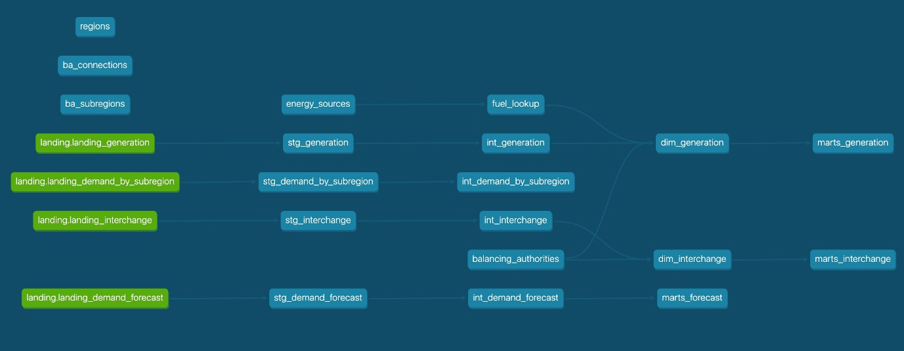

# dbt — EIA Data Transformations

This directory contains the dbt project for transforming raw EIA electricity data into analytics-ready tables. The project is named `eia` and runs against BigQuery.

## Data Lineage

The full lineage graph from dbt docs, showing sources → staging → intermediate → marts:

### Sources (landing layer)

The landing layer is the source of truth for all raw EIA data. Tables are written to by Airflow DAGs, partitioned by day on `partition_date`, and clustered to support efficient downstream queries.

| Source | Description | Partition | Cluster Fields |
|--------|-------------|-----------|----------------|
| `landing.landing_generation` | Raw electricity generation data ingested by Airflow | `partition_date` (DAY) | `respondent`, `fueltype` |
| `landing.landing_demand_by_subregion` | Raw demand data broken down by balancing authority subregion | `partition_date` (DAY) | `parent`, `subba` |
| `landing.landing_interchange` | Raw cross-border interchange data (U.S. ↔ Canada/Mexico) | `partition_date` (DAY) | `fromba`, `toba` |
| `landing.landing_demand_forecast` | Raw demand forecast data | `partition_date` (DAY) | `respondent`, `type` |

Clustering fields are chosen to match the most common upstream query patterns — generation queries typically filter or group by respondent and fuel type, interchange queries by source/destination balancing authority, and demand queries by parent region or forecast type.

### Seeds
| Seed | Description |
|------|-------------|
| `regions` | Static region reference data |
| `ba_connections` | Balancing authority connection mappings |
| `ba_subregions` | Balancing authority subregion mappings |
| `energy_sources` | Energy source classification (renewable / non-renewable) |

### Staging models (`staging/`)
| Model | Description |
|-------|-------------|
| `stg_generation` | Cleaned and typed generation data from `landing_generation` |
| `stg_demand_by_subregion` | Cleaned demand data by subregion |
| `stg_interchange` | Cleaned interchange data |
| `stg_demand_forecast` | Cleaned demand forecast data |

### Intermediate models (`intermediate/`)
| Model | Description |
|-------|-------------|
| `int_generation` | Joins `stg_generation` with `fuel_lookup` and `energy_sources` |
| `int_demand_by_subregion` | Enriches demand data with subregion and region references |
| `int_interchange` | Enriches interchange data with country and BA lookups |
| `int_demand_forecast` | Prepares forecast data for mart output |
| `balancing_authorities` | Derived reference table of balancing authorities used by interchange |

### Dimension & Mart models (`marts/`)
| Model | Description |
|-------|-------------|
| `fuel_lookup` | Fuel type code to human-readable name mappings |
| `dim_generation` | Dimension table for generation with fuel and energy type attributes |
| `dim_interchange` | Dimension table for interchange with provider/recipient country detail |
| `marts_generation` | Final analytics table for electricity generation — consumed by Streamlit |
| `marts_interchange` | Final analytics table for cross-border interchange — consumed by Streamlit |
| `marts_forecast` | Final analytics table for demand and forecast — consumed by Streamlit |

---

## Notes

- The `landing` schema is written to by Airflow DAGs and is the entry point for all raw data into dbt.
- Seeds (`regions`, `ba_connections`, `ba_subregions`, `energy_sources`) are static reference tables and only need to be re-seeded when the underlying CSVs change. These are loaded by the `seed_lookup_tables` Airflow DAG.
- `marts_generation`, `marts_interchange`, and `marts_forecast` are the three tables consumed directly by the Streamlit dashboard.